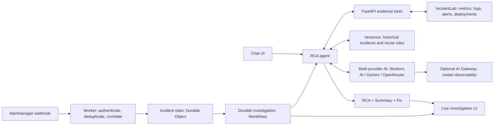

# TraceRoot Architecture

TraceRoot accepts alerts or chat questions, gathers current evidence, and produces proposed incident explanations and fixes. Its Cloudflare runtime owns durable investigation state; the evidence API connects it to the separately maintained lab.

## High-Level Diagram

The provider box is one configurable interface, not parallel inference or automatic failover. The Gateway box represents optional routing/observability on provider calls, not a separate generation stage. Embeddings are configured independently using Google or Workers AI.

## Investigation Lifecycle

1. The authenticated webhook filters firing alerts and deduplicates repeated deliveries. Resolved or unlisted alerts do not initiate work.
2. With active investigations, the selected classification model considers correlation. Confidence validation and configured label scope constrain merges; rejected/failed classifications start separate incidents.
3. A Workflow persists evidence steps and progress. Correlated alerts attach to the existing investigation instead of creating another workflow.
4. Current deployment metadata and scoped logs validate historical reuse conditions. Retrieval similarity is not causal confidence; conflicts or missing conditions require full evidence collection and RCA generation.
5. The agent returns `## RCA`, `## Summary`, and `## Fix`. Unknown causes require supported diagnostic or containment steps, not an invented cause-specific remedy.
6. Durable Object state streams progress and reports to `/investigations` and `/investigations/<id>`. Home chat remains separate.

Interactive chat can call evidence and memory tools directly or start a durable evidence-collection Workflow. Saving a confirmed incident is explicit through the memory tool; neither automatic RCA generation nor retrieval automatically approves a reusable history.

## State & Providers

| Concern | Owner |
| --- | --- |
| Webhook/API and UI assets | Cloudflare Worker |
| Chat, investigation snapshots, shared LLM budget | Agent Durable Object |
| Step recovery and retries | Investigation Workflow |
| Historical embeddings, metadata, reuse conditions | Remote Vectorize |
| Evidence endpoints and Kubernetes inspection | Authenticated local tools API |
| Model request metrics | Optional AI Gateway; application/tool logs complement it |

`MODEL_PROVIDER` selects Workers AI, Gemini, or OpenRouter for chat/RCA. Optional classification overrides select their own provider/model; unset overrides use the main model. `EMBEDDING_PROVIDER` is independent, and vector dimensions/model space must match the stored index. Changing embedding models requires compatible re-indexing or another index.

During local development, Vite/Wrangler runs the Worker, Durable Objects, and Workflows locally. Workers AI and Vectorize bindings remain remote. Shared model-call limits cover automatic correlation/RCA, not every chat or embedding call.

## Boundaries

- Correlation considers currently active investigations; a completed incident is not an active grouping candidate.
- Configured component boundaries suit independent lab incidents, not every real cross-service cascade.
- Evidence tools target a configured demo deployment. They do not execute repairs or prove recovery.
- Similar histories are hypotheses unless current evidence validates explicit reviewed reuse rules.
- Webhook/tools API tokens do not provide application-wide UI authorization. Keep local instances private.
- [IncidentLab](https://github.com/EngineeredByVignesh/IncidentLab) owns the demo app, Kubernetes manifests, alert rules, and observability runbook.

[Local startup](README.md#running-locally) · [Configuration decisions](adrs/) · [Benchmark methodology and limitations](BENCHMARKS.md)
