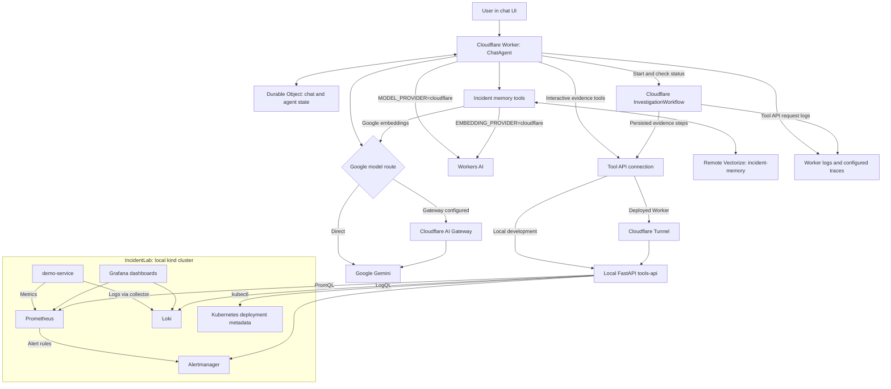

# TraceRoot Architecture and Functionality

TraceRoot is a chat-driven incident investigator for the local IncidentLab Kubernetes environment. It gathers deployment, alert, metric, and log evidence, uses an LLM to reason about it, and suggests a root cause and remediation. It can also collect evidence durably and retrieve saved incidents.

## Architecture

The Worker and workflow run under Wrangler during local development or on Cloudflare after deployment. IncidentLab and tools-api remain on the local machine. Vectorize is remote even during local development. Grafana is for human inspection; the agent queries the underlying services directly.

## Current Functionality

| Capability | Tool | What it does |
| --- | --- | --- |
| Deployment inspection | `getDeployments` | Returns demo-service image, annotations, environment variables, namespace, and rollout status. |
| Active alerts | `getAlerts` | Fetches current Alertmanager alerts. |
| Metrics analysis | `queryMetrics` | Executes an instant PromQL query for error rate, latency, traffic, or health. |
| Log inspection | `queryLogs` | Executes LogQL over a requested lookback, returning up to 500 entries. |
| Durable investigation | `startInvestigationWorkflow` | Starts persisted evidence collection and returns an instance ID and status. |
| Investigation progress | `getInvestigationWorkflowStatus` | Retrieves workflow status and completed output by instance ID. |
| Historical context | `searchSimilarIncidents` | Embeds symptoms and retrieves up to ten similar incidents with metadata and similarity scores. |
| Save an incident | `rememberIncident` | Stores a title, summary, root cause, remediation, labels, and creation time in Vectorize. |

The model selects tools based on the question and streams its answer to the chat UI. Its instructions request deployment, alert, metric, and log evidence before a root-cause answer, and historical searches early in investigations. These are model instructions, rather than a mandatory execution sequence. Each chat response is bounded to 20 model steps.

## Investigation Flow

1. The user describes symptoms, such as demo-service returning 5xx after a rollout.
2. The agent can search memory for similar incidents and gather live evidence through tools-api.
3. Tool results return to the model, which can request further evidence and explain its likely root cause and suggested remediation.
4. For durable collection, the agent starts a workflow and later retrieves its status/output using the returned ID.
5. When asked to remember the incident, the agent stores its RCA details for future retrieval.

The workflow collects five fixed evidence sources sequentially: deployment metadata, alerts, five-minute 5xx error rate, five-minute p95 latency, and recent logs. Each step has three retries with exponential backoff starting at ten seconds and a two-minute timeout. Completed steps are persisted for recovery. The output is an evidence bundle, not an independently generated RCA.

## State, Models, and Observability

- Chat state is persisted by the Agent, with a configured maximum of 100 persisted messages and chat recovery enabled. Old tool calls and reasoning are pruned from model context.
- Gemini chat is selected through `MODEL_PROVIDER=google` and `GEMINI_MODEL`. Workers AI is an alternative selected explicitly by configuration, rather than automatic failure fallback.
- Embeddings have their own provider flag, `EMBEDDING_PROVIDER`. Gemini defaults to `gemini-embedding-001`; Workers AI uses `@cf/google/embeddinggemma-300m`. Both paths target the 768-dimensional cosine Vectorize index.
- Google chat and embedding requests use AI Gateway when configured. Gateway logs expose model-level request status, latency, tokens, and estimated cost where reported.
- The eight incident tools emit structured start, success, and failure logs with timing. HTTP responses from tools-api also emit request status and duration. Workers tracing is enabled in configuration; dedicated spans for every tool are not explicitly implemented.

## Additional Starter Features

The starter also supports adding/removing MCP servers, including OAuth callbacks for servers that require authentication. Connected MCP tools are available to the model; the built-in lab integration uses HTTP tools-api instead.

Scheduling supports creating, listing, and cancelling tasks. Execution currently logs the task and broadcasts a notification to connected clients; it does not run an investigation automatically. Browser timezone lookup and a calculator with approval for large inputs are also retained starter features.

## Current Boundaries

- Built-in lab tools inspect evidence; they do not roll back deployments or execute remediation. Added MCP servers may expose additional capabilities.
- Investigations are initiated through chat. There is no implemented Alertmanager webhook that automatically starts an investigation.
- Deployment inspection and durable evidence queries target demo-service; this is not a general multi-service incident platform.
- Workflow completion does not automatically save an incident or push a generated report into chat. The agent retrieves results and saves memory through separate tools.
- Vectorize writes become searchable asynchronously. Historical similarity is context, not confirmation of a root cause. Changing embedding models requires compatible re-indexing or a separate index.
- tools-api authenticates evidence endpoints with a bearer token. The starter's MCP OAuth is separate from Google API credentials and does not establish application-wide user authorization.

## Repository Ownership

| Repository | Owns |
| --- | --- |
| TraceRoot | Agent UI/runtime, workflow, incident memory integration, tools-api, and ADRs. |
| IncidentLab | Demo application, Docker image definition, Kubernetes manifests, and observability installation runbook. |

See the [runbook](README.md) for local startup and [ADRs](adrs/ADR2-cloudflare-investigation-agent.md) for configuration decisions and upstream setup.
