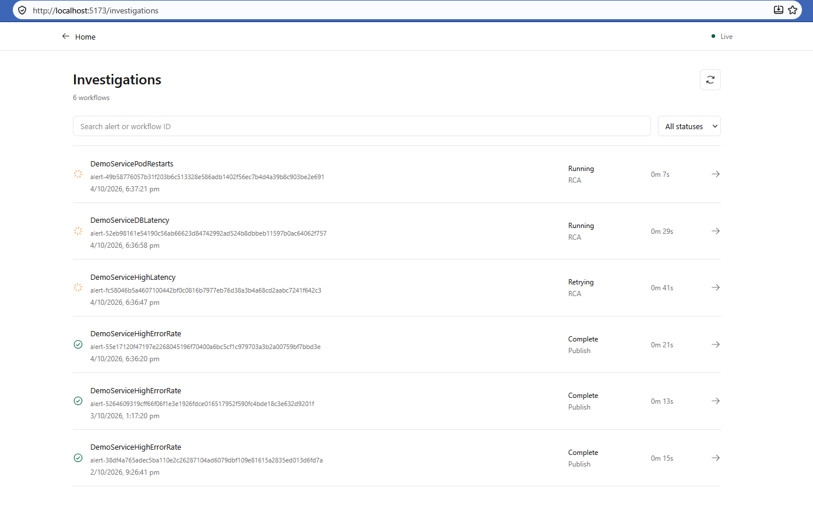
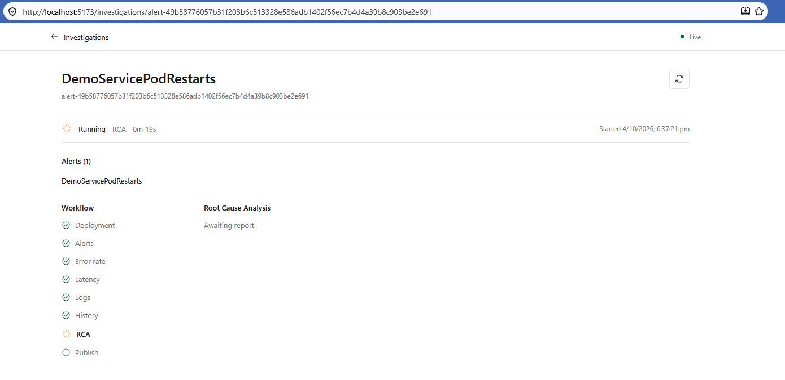
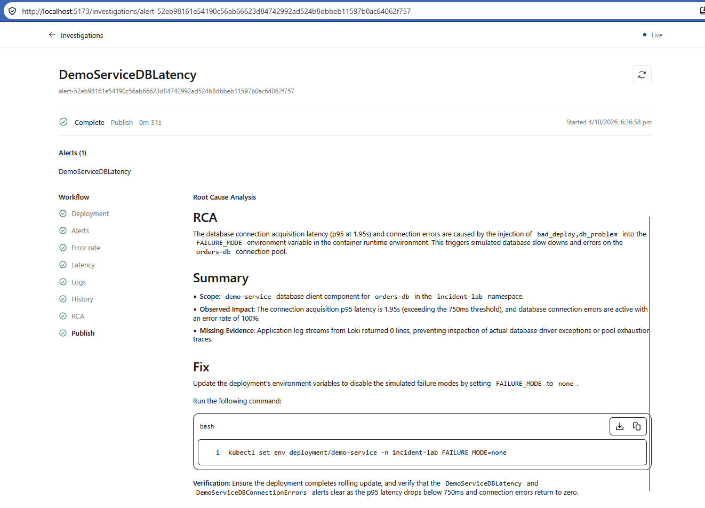

# TraceRoot Demo

Local captures of manual chat and alert-triggered investigations. These are product examples, not benchmark measurements or proof of remediation execution.

## Manual Chat

[Saved chat UI page](pages/manual-chat.html). Open the HTML locally to inspect the captured conversation; GitHub displays its source rather than running it. This is a saved snapshot, not the live application.

For live chat, follow [local startup](../README.md#running-locally), open `/`, and ask the agent to investigate symptoms using deployment, alert, metric, log, and historical evidence.

## Investigation List

Alert-triggered workflows appear at `/investigations`, including running, retrying, and completed investigations.

## Investigation In Progress

Open a workflow to follow its evidence stages and RCA generation in realtime.

## Completed RCA

The database latency example shows the final RCA, Summary, and Fix. Suggested commands are recommendations, not automatically executed repairs.

To reproduce the live scenario, use the [IncidentLab simulation runbook](https://github.com/EngineeredByVignesh/IncidentLab#simultaneous-incident-simulation) and configure [alert delivery](../adrs/ADR7-alert-webhook-investigations.md#local-setup). Historical reuse requires separately reviewed matching conditions; generated reports are not automatically promoted to memory.
